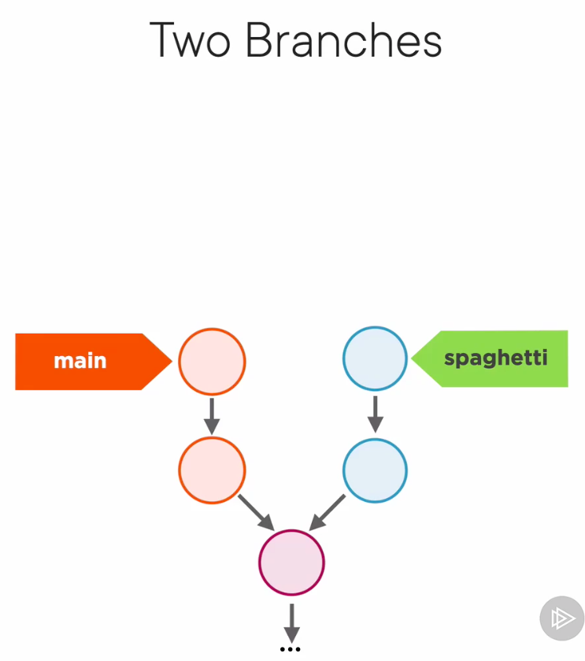
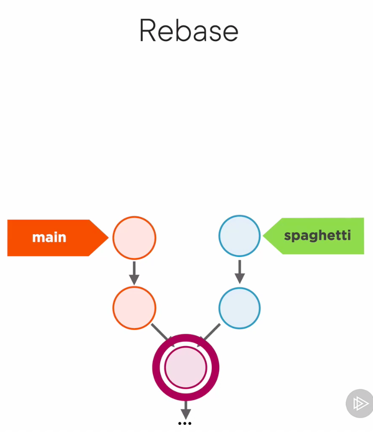
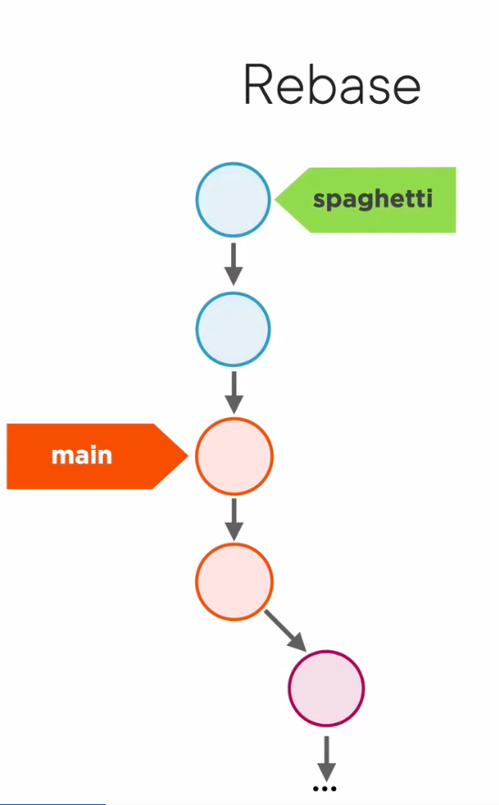
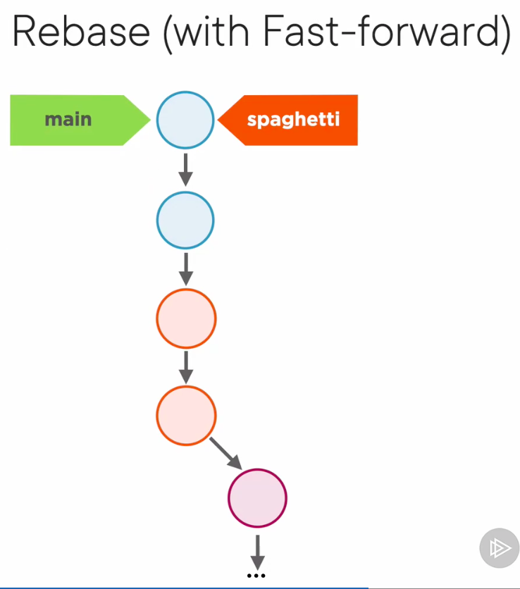

# How Git Works

> If you want to master Git, don't worry about learning the commands. instead, learn the model.  

- Git is: 
  - A distributed Revision Control System.
  - A Revision Control System.
  - Stupid Content Tracker
  - A persistend Map
  - man git to see  

## Git is not What you think

### Values and Hashes
At its core Git is a Map, it's a table with keys and values. The values are just a sequence of bytes, and the key is a hash calculated by git with SHA-1.  


SHA-1 hashes are 20 bytes in hexadecimal format, they are a sequence of 40 hex digits.

Hash with git

```shell
# not usefull
git hash-object "text"

# usefull
echo "text" | git hash-object --stdin
```  

<br />  

> Every object in Git has its own SHA-1. So, what if they collide?  

<br />

```shel
git cat-file -p hash
```

  

<br />

## Branches demystified
Git put branches in a directory called `.git/refs/heads`. A Branch is just a reference to a commit.  

<br />

> HEAD is just a reference to a branch, a pointer to a pointer.  

<br />

You can move to another branch with command:
```shell
git switch branchName
git checkout branchName
```
<hr />

### Losing your HEAD, directly checkout a commit.  

To checkout a commit is necessary to use `checkout` command.

```shell
git checkout 7789899987

cat .git/HEAD
# this point to a commit, not to a branch
```  

<br />

If you run `git branch` you can see that HEAD does not point to a branch. You see this message:
```
* (HEAD detached at 7789899987)
```   

<br />

This is a situation called `detached HEAD`

  

<br />

If we switch back to main branch with `git switch main` 
  

If git objects can't be reached by any reference, Git run a garbage collector, look for objects in the database that cannot be reached from a branch,or HEAD, or TAG, and it will remove them to save disk space

If you want to save this commits you most act now:
- move back to the last commit
- create a branch

  

<br />   

 

<hr />

## Rebasing made Simple  

Let's start with the repository in this state.  

  

Now let's rebase `spaghetti` branch on `main` branch
```shell
git rebase main
```  

- Git looks for the first commit in `spaghetti` branch that is also a commit in `main`.  

  

- Git detaches the entire  `spaghetti` branch from this commit and moves it on top of main. Its changes the base of this branche.  

  

- To sync `main` with `spaghetti` we need to switch to main and execute `git rebase spaghetti`.  



> When in doubt, just merge.

## Tag
Tags is one of the features that turn Git into a revision Control System.
A `Tag` is like a label for a commit.
```shell
git tag release_1
```
We can create a simple tag with just a name, like a simple label, or an annotated tag with additional metadata.
```shell
git tag release_1 -a "Some message"
```
> Switch don't work with tags, use checkout.

## Recap
Branches, merges, rebases and tags are the main features to turn Git from a `stupid content tracker` into a full Version Control System.