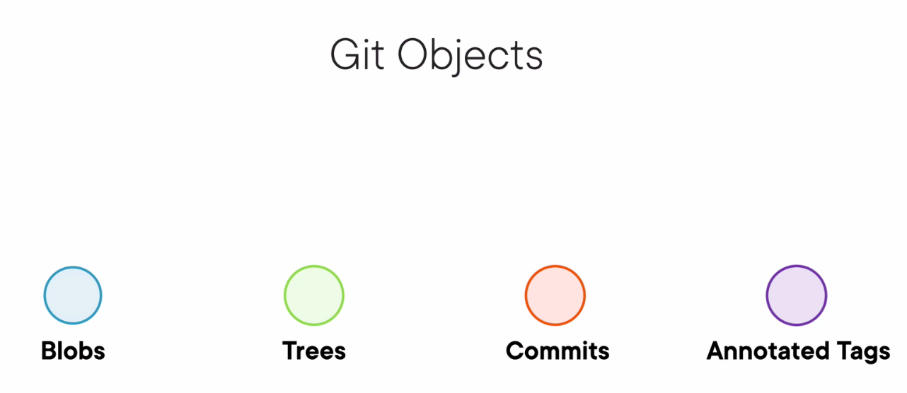
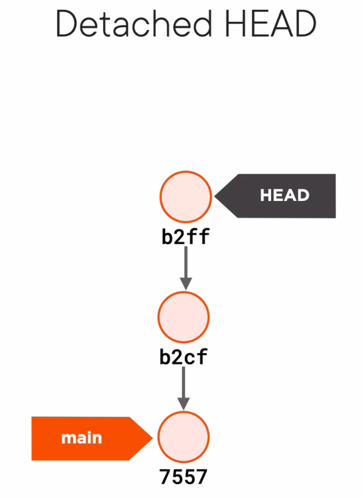
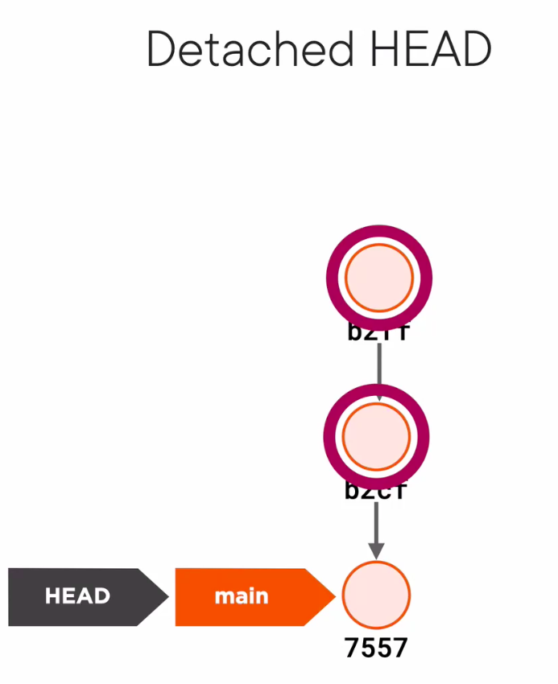
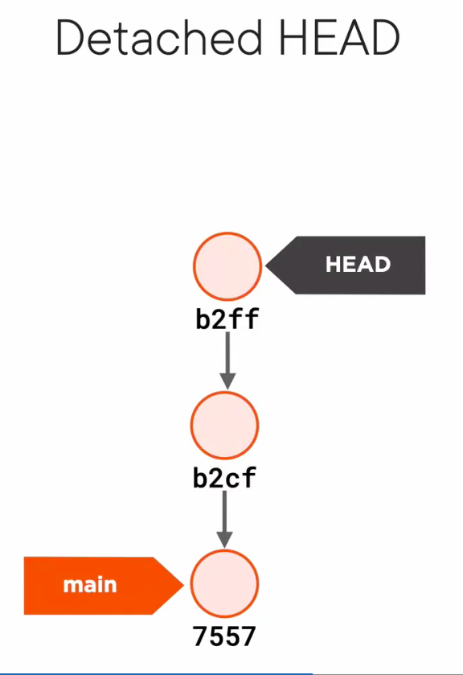
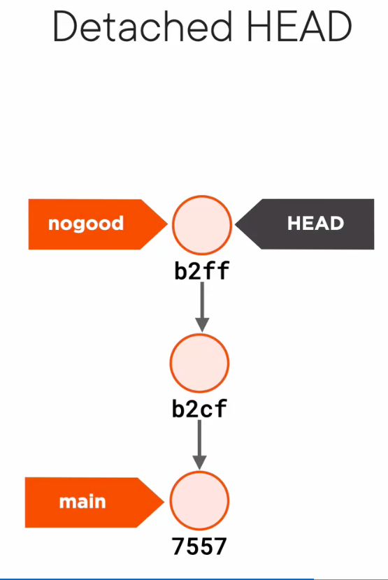

# How Git Works

> If you want to master Git, don't worry about learning the commands. instead, learn the model.

- Git is: 
  - A distributed Revision Control System.
  - A Revision Control System.
  - Stupid Content Tracker
  - A persistend Map
  - man git to see

## Git is not What you think

### Values and Hashes
At its core Git is a Map, it's a table with keys and values. The values are just a sequence of bytes, and the key is a hash calculated by git with SHA-1.  


SHA-1 hashes are 20 bytes in hexadecimal format, they are a sequence of 40 hex digits.

Hash with git

```shell
# not usefull
git hash-object "text"

# usefull
echo "text" | git hash-object --stdin
```

> Every object in Git has its own SHA-1. So, what if they collide?

```shel
git cat-file -p hash
```



## Branches demystified
Git put branches in a directory called `refs/heads`. A Branch is just a reference to a commit.

> HEAD is just a reference to a branch, a pointer to a pointer.

You can move to another branch with command:
```shell
git switch branchName
git checkout branchName
```
<hr />

### Losing your HEAD, directly checkout a commit.
To checkout a commit is necessary to use `checkout` command.

```shell
git checkout 7789899987

cat .git/HEAD
# this point to a commit, not to a branch
```

If you run `git branch` you can see that HEAD does not point to a branch. You see this message:
```
* (HEAD detached at 7789899987)
```
This is a situation called `detached HEAD`



If we switch back to main branch with `git switch main` 



and git objects can't be reached by any reference, Git run a garbage collector, look for objects in the database that cannot be reached from a branch,or HEAD, or TAG, and it will remove them to save disk space

If you want to save this commits you most act now:
- move back to the last commit
- create a branch




<hr />

## Rebasing made Simple