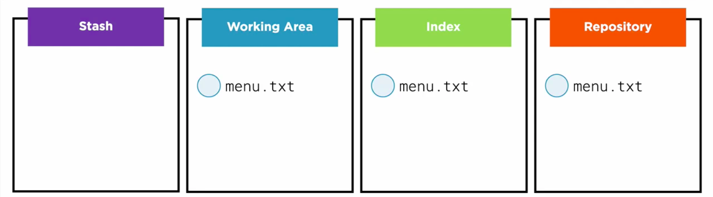
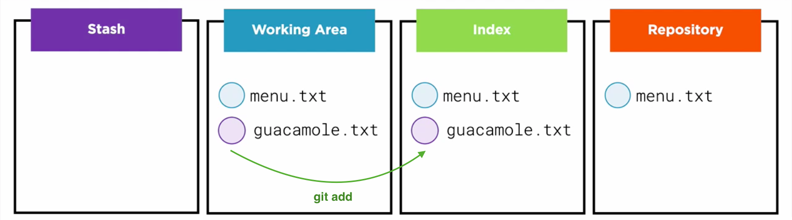
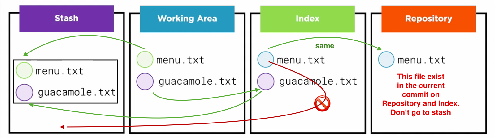
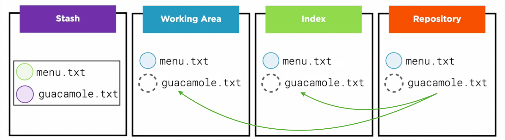
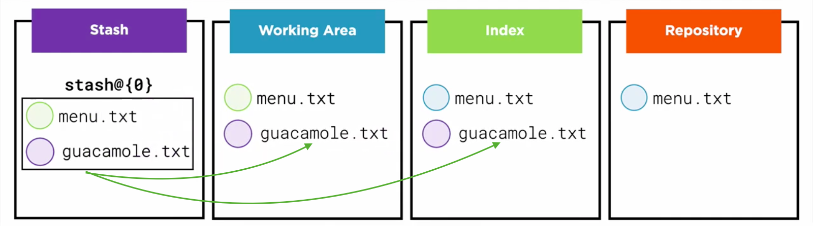

# Mastering Git
<br />

[go back to basics](../README.md)

> <br /> Learning the "Git way of thinking"  
<br/>

## The Four Areas: Introduction
1. The project directory in file system or Woring Area.
2. Repository, contains the history of the project.
3. Index, place where we put your files before a commit.
4. Stash, a temporary storage area.  <br />

  <br />

 <br />

## Repository
The `Repository` lives in `.git` folder in object database. In `Object database` there are few different kinds of objects.
- **Blobs:** Objects that represents the content of a file at some point in the project history.
- **Trees:** Objects that represents folders in the project.
- **Commits:** Objects created when we run git commit. <br />

All of these objects are immutable. These objects are linked together in a structure that represents your project's history.  <br />

   <br/>

## Index
- **Clean status:** When the `Working Area` and `Repository` are aligned.
- Thinking in `Index` as just another area that holds everything, just like the working area and the repository. When you execute `git status` and see the message `nothing to commit, working tree clean` it means that the `Index` contains the same blobs and trees as the `Repository`.
- Update: the clean status is where the three areas are all aligned.  <br />

  <br />

We can check this with `git diff`, but this will compare the **Working Area** with the **Index Area**, that contain exact same data in clean status. To see difference between **Index Area** with **Repository** we use the command `git diff --cached` .In this case we compare the stuff I want to commit with the stuff I already commited.  <br />

## The Four Areas: Basic Workflow  

### Moving Data to the Right
- Lets edit a tracked file in `Working Area`.  <br />

  <br />

- Now copy the updated file from `Working Area` to `Index Area`. To do this we use the command `git add`.  <br />


  <br />

- We can execute `git diff` to ensure there are no differences between `Worinking Area` and `Index Area` and both are aligned.
- If we compare `Index Area` with `Repository`, with the command `git diff --cached`, we can see there are changes between two.  <br />

  <br />

- We are ready to make the next commit with the command `git commit`.  <br />

  <br />

- Now all three areas are aligned again. But `git commit` did more than just copying files, it also created a new commit and other objects in `Objects database`.
- With thsi commands we move data from **left** to **right**.  <br />


### Moving Data to the Left  

To do this we use the command `checkout`. This command do two things.
- In the `Repository`, it moves the **HEAD** reference, generally to another branch, this change the current commit.
- It takes data from the new current commit, and it copies that data from the repository to the `Working Area` and the `Index Area`. It changes `Repository` first and moves data second.  <br />

  

### Removing files.

- To remove file from `Index Area` and/ or `Working Area` we use `git rm`
  - Using `git rm --cached` we keep the file in `Working Area` and only remove from `Index Area`.
  - Usign `git rm -f` to remove from all `Areas`.  <br />

  


  > <br />**"git rm" is not the opposite of "git add"** <br />

### Renaming Files
- Rename or move the desired file.
- Copy changes from the `Working Area` to the `Index Area` with `git add`.
- Finally use `git commit` to copy from `Index Area` to `Repository`, generate a commit, trees and blobs objects.  <br/>
- We can use a convenience command to do this `git mv nameFrom nameTo`  <br />

  

> Git automatically finds out when you're renaming or moving files.  

<br />

## 	The Four Areas: Git Reset

**Reset** moves the current branch, and optionally copies data from the Repository to the other areas.  <br />

### Step 1
- Start here.  <br />
    <br />
- The first step: It moves a branch, generally the current branch, the branch that **HEAD** is point to.  <br />
    <br />
- Reset doesn't move **HEAD.**
- **HEAD** is stull point to the same branch it was point at before, but branch itself is moving.

### Step 2
The second step: Move data from `Repository` to other `Areas`.  <br />
- `git reset --hard`  
- This reset copies data from **new current commit** to `Working Area` and `Index Area`.  <br />
    <br />
- `git reset --mixed`  
- This reset copies data from **new current commit** to `Index Area`, but leaves the `Working Area` alone.  <br /> 
- This is the default behaviour of `git reset`.
    <br />
- `git reset --soft`  
- This reset don't touch any of these areas. Just move the branch and skip step 2.  <br /> 
    <br />

### Reset examples
- Align `Index Area` with `Repository` and don't touch `Working Area`.
  ```shel
  git reset HEAD
  ```
    <br />
- Go back to clean status and align `Index Area` and `Working Area` with `Repository`.
  ```shel
  git reset --hard HEAD
  ```
    <br />

## 	The Four Areas: Advanced Tools

### Stashing Data
There is only one command that affects the stash, `git stash`. The data in the stash don't change unless you really want to.
- Start from clean status.  <br />
    <br />
- Create a new file in `Working Area` and move this file to `Index Area` with command `git add`
    <br />
- Update an existing file in `Working Area`.
    <br />
- Now I need to do some work on another branch, but I don't want my last work to get in the way. Here is where `git stash` can be used. We can store all changes in the **stash** and they stay there, safely, until we decide to get back.
- Store the current status with `git stash save` or `git stash`, and also use the option `--include-untracked`. It means also **stash** files that are still untracked, files that are entirelly new in the `Working Area`. By default `git stash` ignore untracked files.
- Git takes all the data from the `Working Area` and `Index Area` that is not in the current commit in the `Repository`, and copies all of that data to the **stash.**
    <br />
- After the copy to `Stash Area` git checks out the current commit and align all three areas again.
    <br />
- We can read the content of the `Stash Area` with `git stash list`.
- To retrieve the stuff we stashed we use the command `git stash apply`, this will move data from the `Stash Area` to `Working Area` and `Index Area`.
    <br />
- To clear the `Stash Area` use `git stash clear`  <br />

## History: Exploring the Past

### Referencing Commits
- `git log --graph --decorate --oneline` 
  - show graph-like structure 
  - show the positional references, like branches and HEAD.
  - show each commit in one line
- `git show HEAD^`
  - start at HEAD
  - The caret means the parent commit
-  `git show HEAD^^`
  - start at HEAD
  - show parent of parent of HEAD
- `git show HEAD~2`
  - go to HEAD and go back two commits
- `git show HEAD@{"1 month ago"}`

### Tracking Changes in History
Explore how commits are connected.  <br />

- `git blame file` shows where the lines in a file are coming from.
- `git diff` can be used to compare the contents of two areas, two commits, two branches

### Browsing the Log
- `git log --grep filterCriteria --oneline` filter the commits.
- `git log -Gapples --patch` all the commits that added or removed the word **apples** from any file with `git log -G`
  - `--patch` is used to show which lines are impactedby this changes.
- `git log specificBranch..main --oneline`compare commits that are in the main branch but not in other specific branch
  - read as: go from **specificBranch** to **main** and show all the new commits
